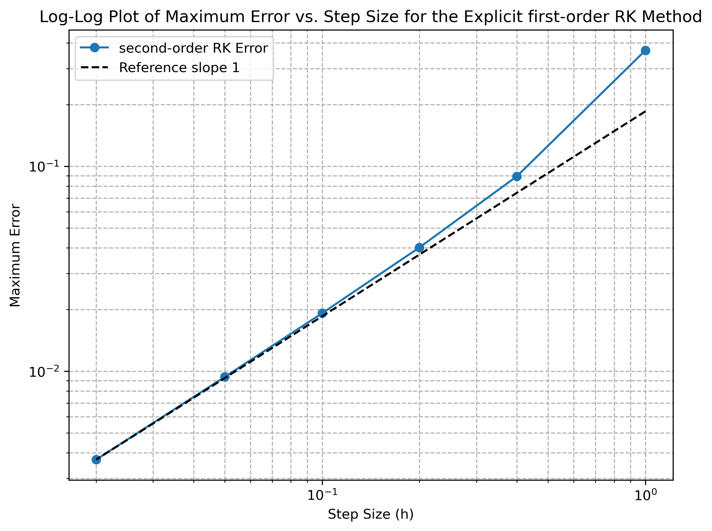
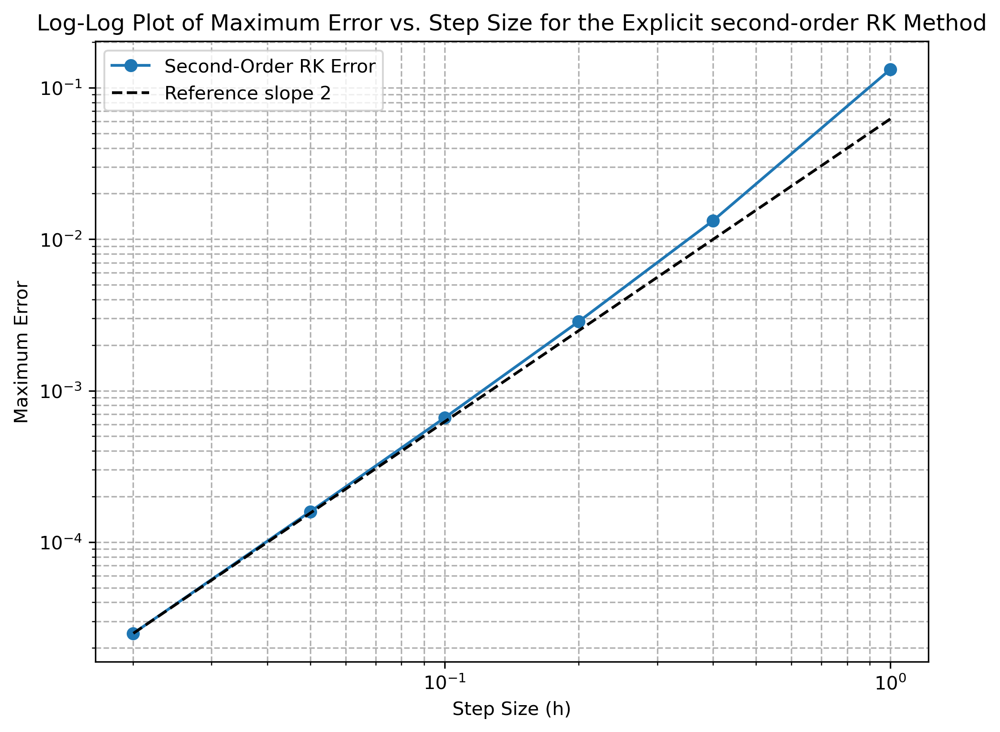
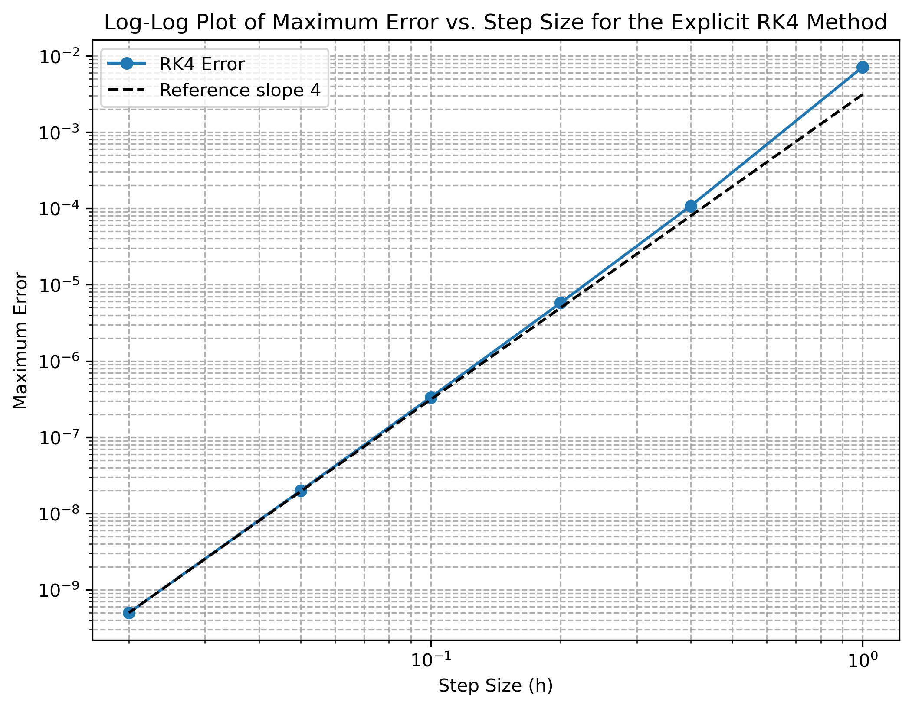

# Arbitrary_Runge-Kutta_Method
This code implements an arbitrary explicit Runge-Kutta method. Log-log error plots are produced for the function dy/dt = -y for explicit RK1 (forward euler/finite difference), original RK2 (trapezoidal), midpoint RK2, and RK4 methods. 
<table>
  <tr>
    <td>
      
    </td>
    <td>
      
    </td>
  </tr>
  <tr>
    <td>
      
    </td>
    <td>
      
    </td>
  </tr>
</table>
