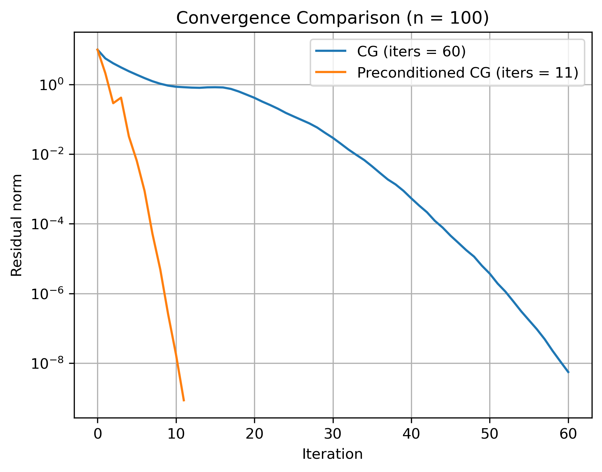

# Conjugate Gradient Solver Using Sparse Matrix Format with Jacobi Preconditioning

This repository implements the Conjugate Gradient algorithm for solving linear systems \(Ax = b\), where the matrix \(A\) is provided in COO (Coordinate) sparse format. The code converts the COO matrix to CSR (Compressed Sparse Row) format for sparse matrix-vector multiplication, applies Jacobi preconditioning, and iteratively solves the system.

The convergence rates of the Conjugate Gradient algorithm with and without preconditioning for a 100 x 100 matrix are plotted. 

## Example Usage and Plot

- Symmetric, diagonally dominant tridiagonal matrix.  
- Size: n x n for n = 100  
- Diagonal entries: 1 to n (increasing)  
- Off-diagonal entries: random in [0,1)  
- Positive definite (due to diagonal dominance)

---

## Reference

Shewchuk, Jonathan Richard. *An Introduction to the Conjugate Gradient Method Without the Agonizing Pain*. Carnegie Mellon University, 1994.  
[https://www.cs.cmu.edu/~quake-papers/painless-conjugate-gradient.pdf](https://www.cs.cmu.edu/~quake-papers/painless-conjugate-gradient.pdf)
