# Image_Singular_Value_Decomposition
This program uses the singular value decompsition on a grayscaled image and reconstructs it using the first "k" singular values

## SVD Image Compression Results

### Compressed Images (using top-k singular values):

| k = 5 | k = 10 | k = 15 | k = 20 |
|-------|--------|--------|--------|
| 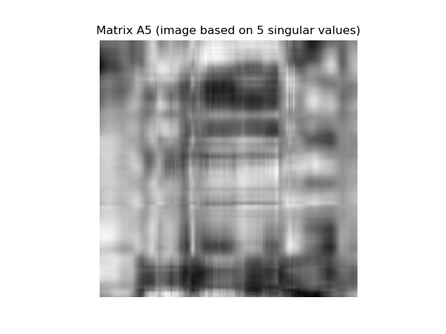 | 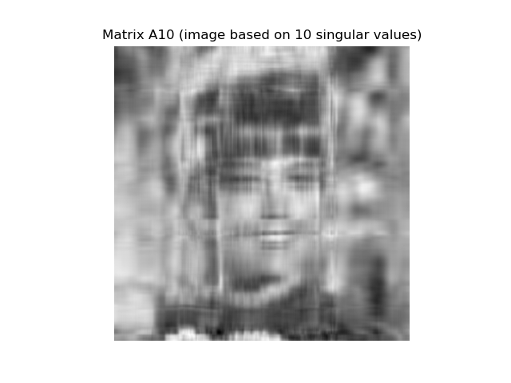 | 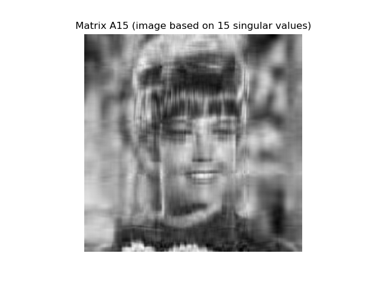 |  |

| k = 50 | k = 100 | k = 200 | k = 300 |
|--------|---------|---------|---------|
|  |  |  | 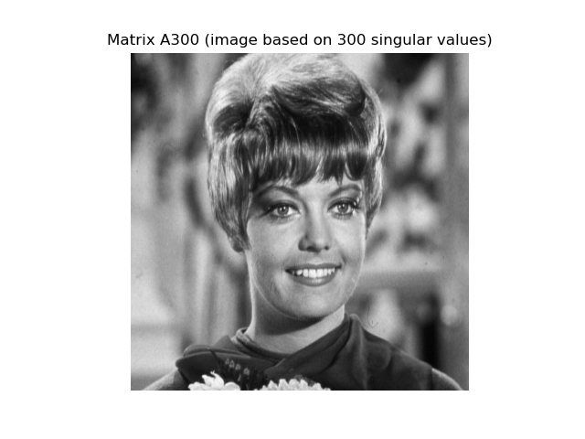 |

| k = 500 |
|---------|
|  |

---

### Error Images (difference between original and compressed):

| k = 5 | k = 10 | k = 15 | k = 20 |
|-------|--------|--------|--------|
| 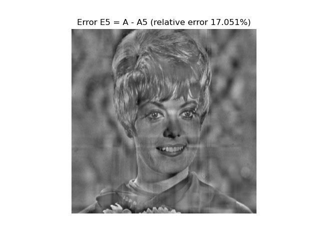 | 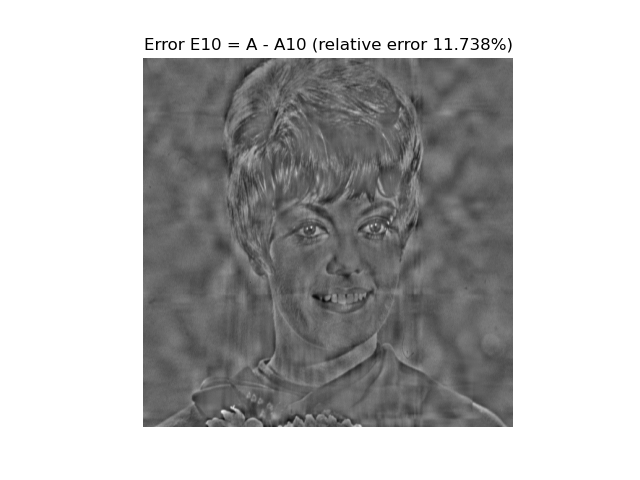 | 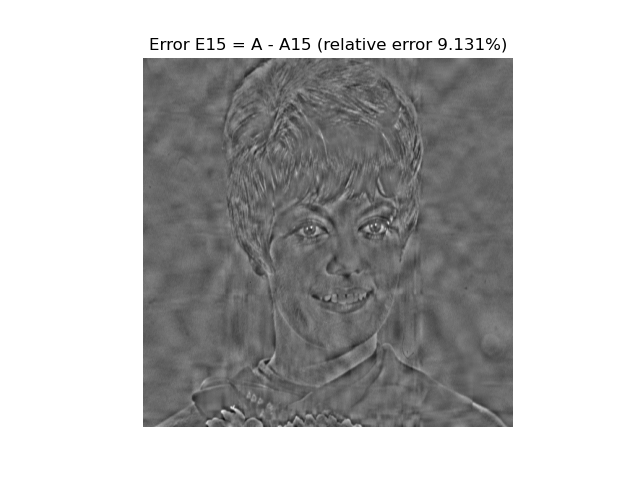 | 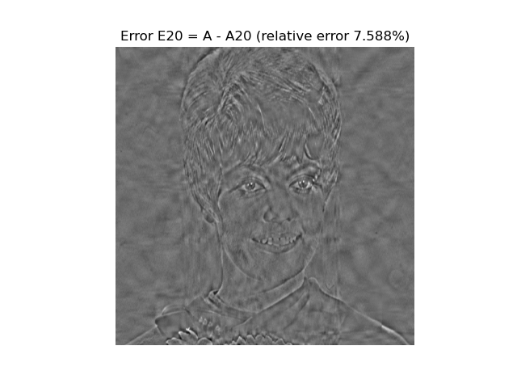 |

| k = 50 | k = 100 | k = 200 | k = 300 |
|--------|---------|---------|---------|
| 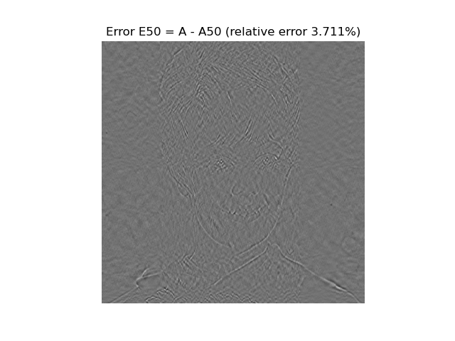 | 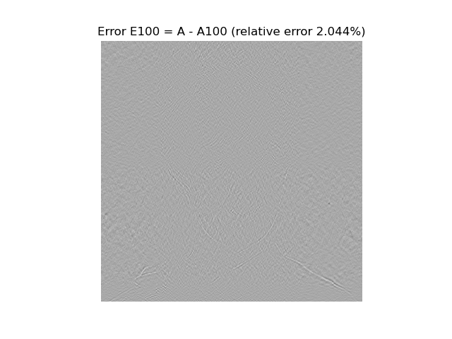 |  | 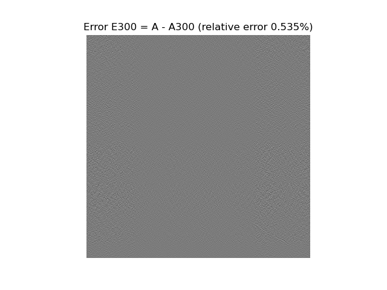 |

| k = 500 |
|---------|
| 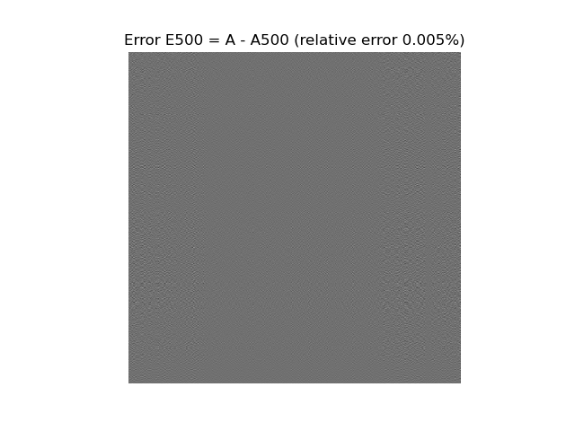 |
