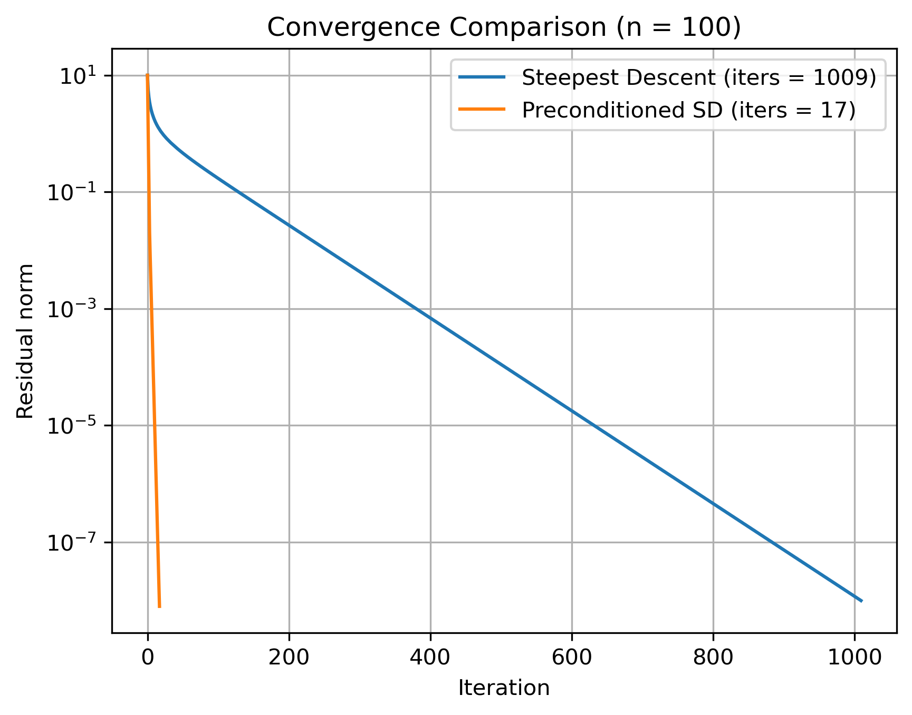

# Steepest Descent Solver Using Sparse Matrix Format with Jacobi Preconditioning

This repository implements the Steepest Descent algorithm for solving linear systems \(Ax = b\), where the matrix \(A\) is provided in COO (Coordinate) sparse format. The code converts the COO matrix to CSR (Compressed Sparse Row) format for sparse matrix-vector multiplication, applies Jacobi preconditioning, and iteratively solves the system.

The convergence rates of the Steepest Descent algorithm with and without preconditioning for a 100 x 100 matrix are plotted. 

---

## Overview

The main components include:

- **`coo2csr(A, M)`**  
  Converts a COO formatted sparse matrix to CSR format for efficient matrix operations.

- **`csr_vp(colind, rowptr, vals, x, M)`**  
  Performs sparse matrix-vector product using CSR data structures.

- **`Steepest_Descent(A, b, N)`**  
  Implements the steepest descent algorithm using the CSR matrix-vector product to solve \(Ax = b\).

- **`PreCond_Steepest_Descent(A, b, N)`**  
  Implements the steepest descent algorithm using Jacobi preconditioning and the CSR matrix-vector product to solve \(Ax = b\).

---

## Code Summary

### COO to CSR Conversion (`coo2csr`)

- **Input:** COO matrix `A` as a list of triples \((row, col, val)\), matrix size \(M\).

- **Output:**  
  - `colind`: column indices of non-zero elements  
  - `rowptr`: pointers to start of each row in `colind` and `vals` arrays  
  - `vals`: non-zero values of the matrix

### Sparse Matrix-Vector Product (`csr_vp`)

- Efficiently computes \(y = Ax\) where \(A\) is in CSR format.

### Steepest Descent Solver (`Steepest_Descent`)

- Converts input COO matrix to CSR.

- Starts from zero vector initial guess.

- Iterates until residual norm is below \(10^{-8}\).

- Returns solution vector, iteration count, and residual norms history.

### Preconditioned Steepest Descent Solver (`PreCond_Steepest_Descent`)

- Converts input COO matrix to CSR.

- Builds Jacobi preconditioner \(M = \mathrm{diag}(A)^{-1}\) in CSR form.

- Starts from zero vector initial guess.

- Iterates until residual norm is below \(10^{-8}\).

- Returns solution vector, iteration count, and residual norms history.

---

## Example Usage and Plot

- Symmetric, diagonally dominant tridiagonal matrix.  
- Size: n x n for n = 100  
- Diagonal entries: 1 to n (increasing)  
- Off-diagonal entries: random in [0,1)  
- Positive definite (due to diagonal dominance)

---

## Reference

Shewchuk, Jonathan Richard. *An Introduction to the Conjugate Gradient Method Without the Agonizing Pain*. Carnegie Mellon University, 1994.  
[https://www.cs.cmu.edu/~quake-papers/painless-conjugate-gradient.pdf](https://www.cs.cmu.edu/~quake-papers/painless-conjugate-gradient.pdf)
